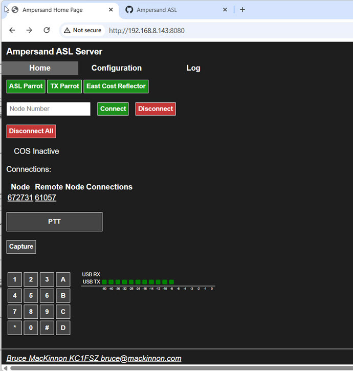
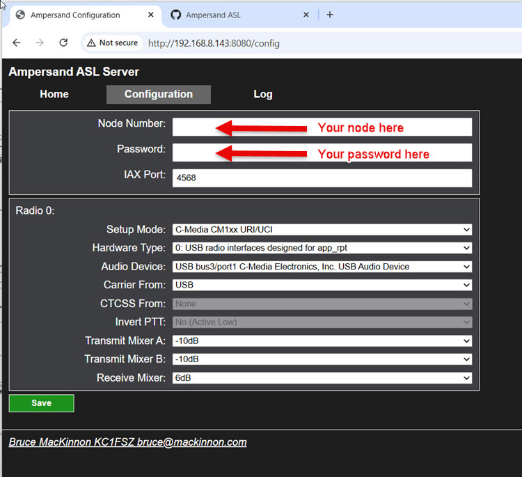
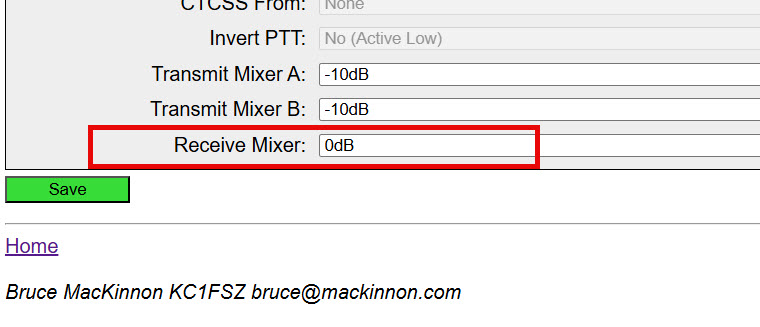

# Ampersand Server User/Install Documentation

At the moment the Ampersand Server (amp-server) provides a basic [All Star Link](https://www.allstarlink.org/) node
for desktop radio-less use. Future releases will enable more functionality. Send
comments/questions to Bruce MacKinnon (KC1FSZ) using the e-mail address in [QRZ](https://www.qrz.com/db/KC1FSZ).

This is experimental work that explores the potential of ASL linking 
without the use of the Asterisk PBX system. [Project documentation is here](https://mackinnon.info/ampersand/). 

All of the testing of this system is happening on either:
* A Raspberry Pi 5 running Debian 12 Bookworm. This is an ARM-64 platform.
* A Dell Wyse 3040 mini-PC running Debian 13 Trixie. This is an x86-64 platform.

A separate build for ARM Cortex-M3 microcontroller boards has also been tested.
This will be documented separately.

All of my Linux testing has been done using an [AllScan](https://allscan.info/) UCI90 audio interface or the [Repeater Builder](https://www.repeater-builder.com/products/stm32-dvm.html) RB-USB RIM Lite module. Both are based on the C-Media C1xx audio 
chip. 

The [change log is located here](../CHANGELOG.md). I try to keep it up to date.

Network Setup (IPv4)
====================

There are other detailed sources of information about ASL network configuration so 
I won't repeat everything here. Bottom line:

* Make sure you are clear on what IAX (UDP) port your node is using. This assignment
happens on the [ASL Portal](https://www.allstarlink.org/portal/servers.php). UDP port 4569 is the common default.
* Make sure that your IAX port is properly configured on the Ampersand Configuration 
screen (see below).
* If you expect to receive inbound calls make sure that your IAX port is opened/forwarded through your firewall/NAT system.
* If you expect to receive inbound calls make sure that your IAX port is opened on any Linux/Windows firewall tools that are 
running on your machine (if applicable).
* You can test your network connection using the 61057 parrot. If the 61057 parrot
tells you that your "network test succeeded" that means that your firewall is open
and that you can accept inbound calls.

Network Setup (IPv6)
====================

(To follow shortly)

Installation Instructions
=========================

Install required packages:

    sudo apt install wget net-tools libcurl4-gnutls-dev

An adjustment needs to be made to allow non-root users to access the HID interfaces. This is relevant to the COS/PTT signals. Create /etc/udev/rules.d/99-mydevice.rules with this contents:

    # The C-Media vendor ID
    SUBSYSTEM=="hidraw", ATTRS{idVendor}=="0d8c", MODE="0666", TAG+="uaccess"

(And include any other devices you plan to use. I've noticed that the ASL3 installer
also includes vendor ID 1209 in their configuration.)

Reboot, or just force reload of rules:

    sudo udevadm control --reload-rules
    sudo udevadm trigger

If you are already running the Ampersand Server (i.e. this is an upgrade),
you will need to shut down the service:

    sudo systemctl stop amp-server

Installation steps:

    export AMP_SERVER_VERSION=20260128
    export AMP_ARCH=$(uname -m)
    wget https://ampersand-asl.s3.us-west-1.amazonaws.com/releases/amp-${AMP_SERVER_VERSION}-${AMP_ARCH}.tar.gz
    tar xvf amp-${AMP_SERVER_VERSION}-${AMP_ARCH}.tar.gz
    ln -s amp-${AMP_SERVER_VERSION}-${AMP_ARCH} amp

In case you need the links:

* The latest package for x86-64 is here: [https://ampersand-asl.s3.us-west-1.amazonaws.com/releases/amp-20260128-x86_64.tar.gz](https://ampersand-asl.s3.us-west-1.amazonaws.com/releases/amp-20260128-x86_64.tar.gz)
* The latest package for arm-64 is here: [https://ampersand-asl.s3.us-west-1.amazonaws.com/releases/amp-20260128-aarch64.tar.gz](https://ampersand-asl.s3.us-west-1.amazonaws.com/releases/amp-20260128-aarch64.tar.gz)

Running the Server 
==================

    cd amp
    ./amp-server 

Command-line options should be used if you want to override defaults:

* --httport (defaults to 8080).  Used to change the port that the web UI runs on.
* --config (defaults $HOME/amp-server.json). Used to change the location of the configuration 
file.
* --trace Used to turn on extended network tracing.

The server is operated via a web UI. Point your browser to the server using port 8080 (the default), or a different port if you
have configured one on the command line.  The main screen will look like this:

Running As A Linux Service
==========================

You might want to run your AMP Server as a service. This is optional, but
it will keep the server running after you log out or reboot.

Copy the amp-server binary to /usr/bin.

Create a service file called /lib/systemd/system/amp-server.service that looks
something like this:

    [Unit]
    Description=AMP Server
    After=network.target
    StartLimitIntervalSec=0

    [Service]
    Type=simple
    Restart=always
    RestartSec=1
    # Change to your id, best not to run as root
    User=bruce
    ExecStart=/usr/bin/amp-server
    WorkingDirectory=/tmp
    RestrictRealtime=off
    # Make the process real-time with high priority
    # The + requests higher privileges.
    ExecStartPost=+/bin/sh -c "/usr/bin/chrt --rr -p 50 $MAINPID"

    [Install]
    WantedBy=multi-user.target

Enable and start the service:

    sudo systemctl enable amp-server
    sudo systemctl start amp-server

You can view the log using this command:

    journalctl -u amp-server -f

Setup/Configuration
===================

Press the "Configuration" tab at the top of the screen to get to the configuration screen
that looks like this:

This configuration should be very consistent with that used on the ASL system. Fill 
in your node number, password, and IAX port number. All other defaults should be enough to get your started.

The audio levels will be the first thing to configure. Your audio level will be displayed in 
the system log any time you key your microphone (regardless of whether you are connected to 
any other nodes). The levels will be displayed like this:

The audio level that you are transmitting into the ASL network is controlled using the 
"Receive Mixer" level on the configuration screen. This is a bit confusing since
the "Receive" in this context is from the perspective of the radio interface hardware.

Current Development In Process
==============================

* More status messages need to be shown on the main page, particular when connection fails.
* Private node support.
* Kerchunk filter.
* PTT signal support.
* Repeater functionality.
* Display list of linked nodes for each node.

Discarding HID Input
====================

(Please see [this article for more detail](https://www.florian-wolters.de/posts/discard-hid-input-from-cm108-device/))

There's an interesting problem that shows up on my computer when using
CM1XX-based radio interfaces. Per convention, most interface vendors
have connected the carrier detect (COS) signal to the **Volume Down**
pin on the CM108 chip. This is nice since it allows application software
to read the COS signal status without any additional hardware, but it can create
strange behaviors if your desktop environment thinks that you want to turn 
the audio volume down every time a carrier is detected. This behavior 
depends on your desktop configuration, but I've had this problem on Windows
and Linux.

Linux provides a way to work around this. It turns out the CM1XX volume
down pin is mapped to a keypress event to achieve the volume function.
This can be undone.

Create a custom udev hwdb rule file called /etc/udev/hwdb.d/50-cm108.hwdb.

Put this into the file, substituting the **correct** USB vendor ID/product ID:

    # Ignore HID input events from CM108 GPIOs. NOTE: Exactly one space
    # before the "KEYBOARD_KEY ..." line.
    evdev:input:b*v0D8Cp0012*
     KEYBOARD_KEY_c00ea=reserved

The "v0D8Cp0012" above refers the vendor ID/product ID of a common C-Media
USB audio interface, but **it's possible that your device will have a different
product ID**. Please use the lsusb command to validate the IDs being presented
by your hardware.

And then reload the hwdb:

    udevadm systemd-hwdb update
    udevadm trigger

Another Possible Solution to the "Volume Down" Problem
======================================================

Linux installations that include the Pulse Audio system 
may introduce a different variant of the CM1xx Volume Down 
problem. Pulse Audio often appears on systems that install a Window 
Manager (ex: KDE) since it improves the end-user experience.

I'm not a Pulse Audio expert, but it appears that:
* The Master Volume setting on the desktop is controlled by 
the volume up/down controls on the keyboard and possibly by 
the buttons on other CM1xx devices that are connected.
* When the Pulse Audio Master Volume is reduced, it also reduces
the volume on other sound devices that are under Pulse Audio control.

_(NOTE: If anyone understands this mechanism better, please reach out.)_

It's the second point above that causes the big problem. Every 
time the COS signal is asserted, the output volume on the audio 
interface is reduced. This is a frustrating problem.

This can be resolved by disconnecting the CM1xx interface device 
being used for ASL from Pulse Audio control:

* Start the pavucontrol tool, which should open a sound control screen.
* Go to the Configuration tab.
* Find your USB audio device.
* Select the "Off" option on the drop-down menu.
    
Network Debugging Hints
=======================

* Pay close attention to the UDP port number you are using. Each ASL Node 
number is associated with an ASL Server. Each ASL Server is assigned a 
UDP port for IAX traffic. Sometimes people get confused about this when they
start running multiple nodes.
* Just because your node can call out doesn't mean that you can accept 
calls. The firewall/NAT adjustments described above aren't required to 
make outgoing calls - only to receive incoming ones.
* A valid ASL registration is required for some nodes to accept your call.
*ASL parrots often do not require registration* so if you find that your
call is accepted by a parrot but not by other nodes it is likely that your 
registration is invalid. Check your password.
* The ASL registration process takes some time to propagate. When your node
first starts up your calls may not be accepted. Wait about 10 minutes and try again.
* Test using parrot 61057 **before asking for network help**. This parrot will provide 
information about whether (a) your node is registered and (b) whether your 
node is reachable from the outside.

Asking For Help
===============

I'm happy to take any questions, but keep in mind that I'm not an expert on
Linux administration.

