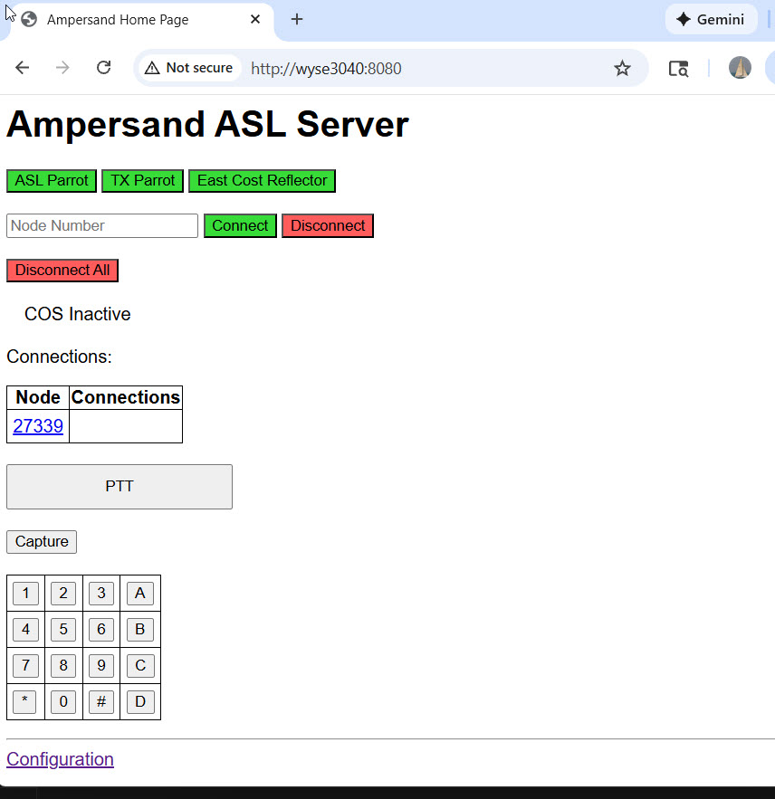
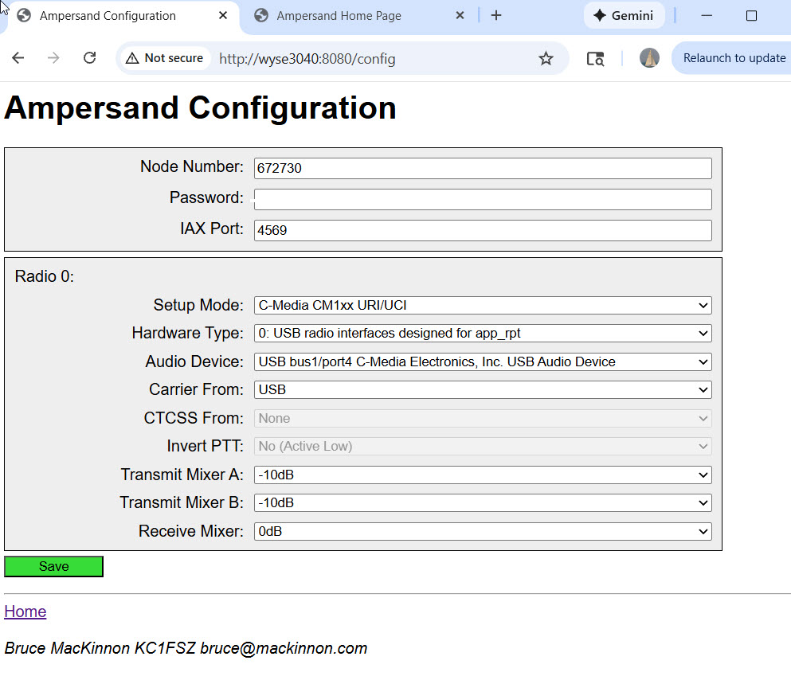
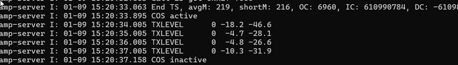

At the moment the Ampersand Server (amp-server) provides a basic [All Star Link](https://www.allstarlink.org/) node
for desktop radio-less use. Future releases will enable more functionality. Send
comments/questions to Bruce MacKinnon (KC1FSZ) using the e-mail address in QRZ.

This is experimental work that explores the potential of ASL linking 
without the use of the Asterisk PBX system. 

All of the testing of this system is happening on either:
* A Raspberry Pi 5 running Debian 12 Bookworm. This is an ARM-64 platform.
* A Dell Wyse 3040 mini-PC running Debian 13 Trixie. This is an x86-64 platform.

A separate build for ARM Cortex-M3 microcontroller boards has also been tested.
This will be documented separately.

All of my Linux testing has been done using an [AllScan](https://allscan.info/) UCI90 audio interface or the [Repeater Builder](https://www.repeater-builder.com/products/stm32-dvm.html) RB-USB RIM Lite module. Both are based on the C-Media C1xx audio 
chip. 

Installation Instructions
=========================

Install required packages:

    sudo apt install wget net-tools libcurl4-gnutls-dev

An adjustment needs to be made to allow non-root users to access the HID interfaces. Create /etc/udev/rules.d/99-mydevice.rules with this contents:

    # The C-Media vendor ID
    SUBSYSTEM=="hidraw", ATTRS{idVendor}=="0d8c", MODE="0666", TAG+="uaccess"

(And include any other devices you plan to use)

Reboot, or just force reload of rules:

    sudo udevadm control --reload-rules
    sudo udevadm trigger

Installing for x86-64:

    wget https://mackinnon.info/ampersand/releases/amp-20260109-x86_64.tar.gz
    tar xvf amp-20260109-x86_64.tar.gz
    ln -s amp-20260109-x86_64 amp

Installing for aarch64 (ARM):

    wget https://mackinnon.info/ampersand/releases/amp-20260109-aarch64.tar.gz
    tar xvf amp-20260109-aarch64.tar.gz
    ln -s amp-20260109-aarch64 amp

Running the Server
==================

    cd amp
    ./amp-server 

Command-line options should be used if you want to override defaults:

* --httport (defaults to 8080).  Used to change the port that the web UI runs on.
* --config (defaults $HOME/amp-server.json). Used to change the location of the configuration 
file.
* --trace Used to turn on extended network tracing.

Setup/Configuration
===================

All configuration is done via a web UI. Start the server and point your browser to the server using port 8080 (the default), or a different port if you
have configured one on the command line.  The main screen will look like this:

Press the "Configuration" link at the bottom of the screen to get to the configuration screen
that looks like this:

Fill in your node number and password. All other defaults should be enough to get your started.

The audio levels will be the first thing to configure. Your audio level will be displayed in 
the system log any time you key your transmitter (regardless of whether you are connected to 
any other nodes). The levels will be displayed like this:

Things That Aren't Enabled Yet
==============================

* DTMF pad
* CTCSS/PTT functionality
* Repeater functionality
* List of linked nodes for each node
* More status messages need to be shown on the main page

Discarding HID Input
====================

(Please see [this article for more detail](https://www.florian-wolters.de/posts/discard-hid-input-from-cm108-device/))

There's an interesting problem that shows up on my computer when using
CM108-based radio interfaces. Per convention, most interface vendors
have connected the carrier detect (COS) signal to the "Volume Down" 
pin on the CM108 chip. This is nice since it allows application software
to read the COS signal without any additional hardware, but it can create
strange behaviors if your desktop environment thinks that you want to turn 
the audio volume down every time a carrier is detected. This behavior 
depends on your desktop configuration, but I've had this problem on Windows
and Linux.

Linux provides a way to work around this. It turns out the CM108 volume
down pin is mapped to a keypress event to achieve the volume function.
This can be undone.

Create a custom udev hwdb rule file called /etc/udev/hwdb.d/50-cm108.hwdb.

Put this into the file, substituting the correct USB vendor ID/product ID:

    # Ignore hid input events from cm108 GPIOs
    evdev:input:b*v0D8Cp013C*
        KEYBOARD_KEY_c00ea=reserved

And then reload the hwdb:

    udevadm hwdb –update
    udevadm trigger
