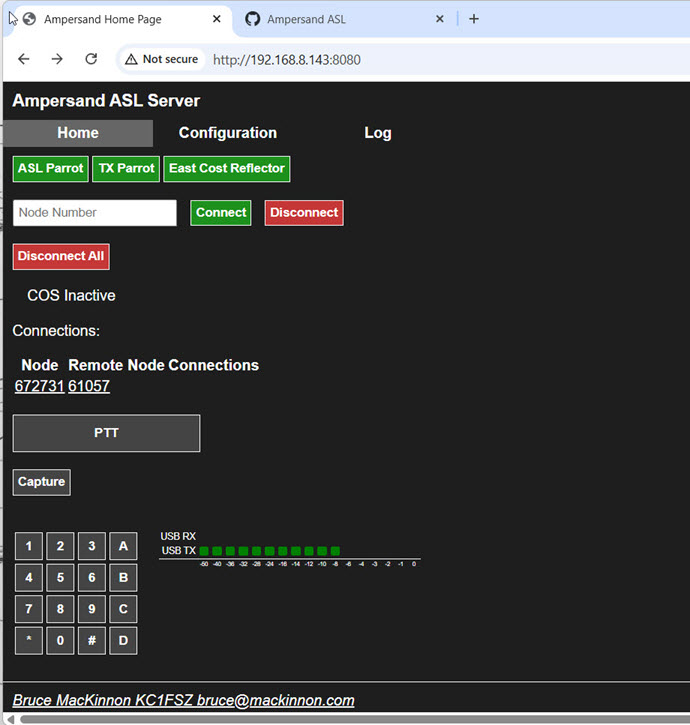
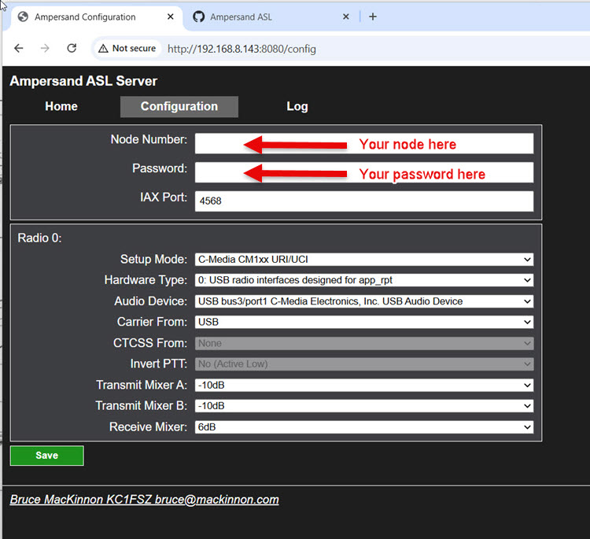
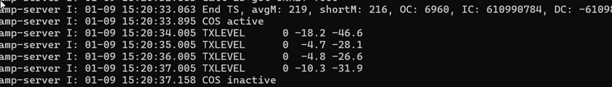
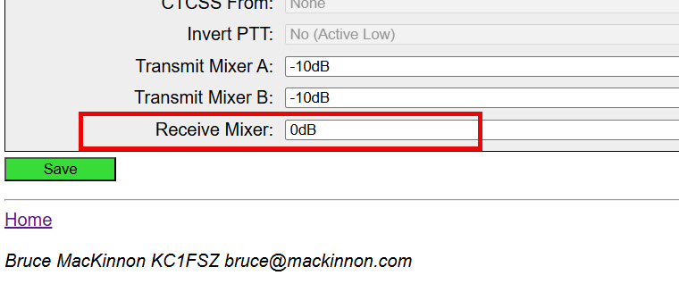
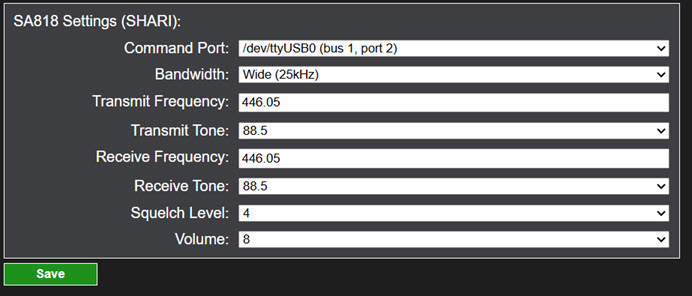

# Ampersand Server User/Install Documentation

At the moment the Ampersand Server (amp-server) provides a basic [All Star Link](https://www.allstarlink.org/) node for desktop radio-less and simple hot-spot use. Future releases will enable more functionality. Send
comments/questions to Bruce MacKinnon (KC1FSZ) using the e-mail address in [QRZ](https://www.qrz.com/db/KC1FSZ).

This is experimental work that explores the potential of ASL linking 
without the use of the Asterisk PBX system. [Project documentation is here](https://mackinnon.info/ampersand/). 

All of the testing of this system is happening on either:
* A Raspberry Pi 5 running Debian 12 Bookworm. This is an ARM-64 platform.
* A Dell Wyse 3040 mini-PC running Debian 13 Trixie. This is an x86-64 platform.

A separate build for ARM Cortex-M33 microcontroller boards has also been tested.
This will be documented separately.

All of my Linux testing has been done using an [AllScan](https://allscan.info/) UCI90 audio interface or the [Repeater Builder](https://www.repeater-builder.com/products/stm32-dvm.html) RB-USB RIM Lite module. Both are based on the C-Media C1xx audio 
chip. 

If you are looking for a cloud-based "virtual or "hub" server, the [Ampersand Hub Project](https://github.com/Ampersand-ASL/amp-hub) is a 
better choice for you.

The [change log is located here](../CHANGELOG.md). I try to keep it up to date.

> [!IMPORTANT]
> If you are using the AllStarLink system please [make a dontation](https://www.allstarlink.org/about/donate.php) to support the network. 

Network Setup (IPv4)
====================

There are other detailed sources of information about ASL network configuration so 
I won't repeat everything here. Bottom line:

* Make sure you are clear on what IAX (UDP) port your node is using. This assignment
happens on the [ASL Portal](https://www.allstarlink.org/portal/servers.php). UDP port 4569 is the common default.
* Make sure that your IAX port is properly configured on the Ampersand Configuration 
screen (see below).
* If you expect to receive inbound calls make sure that your IAX port is opened/forwarded through your firewall/NAT system.
* If you expect to receive inbound calls make sure that your IAX port is opened on any Linux/Windows firewall tools that are 
running on your machine (if applicable).
* You can test your network connection using the 61057 parrot. If the 61057 parrot
tells you that your "network test succeeded" that means that your firewall is open
and that you can accept inbound calls.

Network Setup (IPv6)
====================

(To follow shortly)

Installation Instructions (Linux)
=================================

Install required packages:

    sudo apt install wget net-tools libcurl4-gnutls-dev

An adjustment needs to be made to allow non-root users to access the HID interfaces. This is relevant to the COS/PTT signals. Create /etc/udev/rules.d/99-mydevice.rules with this contents:

    # The C-Media vendor ID
    SUBSYSTEM=="hidraw", ATTRS{idVendor}=="0d8c", MODE="0666", TAG+="uaccess"

(And include any other devices you plan to use. I've noticed that the ASL3 installer
also includes vendor ID 1209 in their configuration.)

Reboot, or just force reload of rules:

    sudo udevadm control --reload-rules
    sudo udevadm trigger

If you are already running the Ampersand Server (i.e. this is an upgrade),
you will need to shut down the service:

    sudo systemctl stop amp-server

Installation steps:

    export AMP_SERVER_VERSION=20260516
    export AMP_ARCH=$(uname -m)
    wget https://ampersand-asl.s3.us-west-1.amazonaws.com/releases/amp-${AMP_SERVER_VERSION}-${AMP_ARCH}.tar.gz
    tar xvf amp-${AMP_SERVER_VERSION}-${AMP_ARCH}.tar.gz
    ln -s amp-${AMP_SERVER_VERSION}-${AMP_ARCH} amp

In case you need the links:

* The latest package for arm-64 is here: [https://ampersand-asl.s3.us-west-1.amazonaws.com/releases/amp-20260516-aarch64.tar.gz](https://ampersand-asl.s3.us-west-1.amazonaws.com/releases/amp-20260516-aarch64.tar.gz)
* The latest package for x86-64 is here: [https://ampersand-asl.s3.us-west-1.amazonaws.com/releases/amp-20260516-x86_64.tar.gz](https://ampersand-asl.s3.us-west-1.amazonaws.com/releases/amp-20260516-x86_64.tar.gz)

Running the Server (Linux)
==========================

    cd amp
    ./amp-server 

Command-line options should be used if you want to override defaults:

* --httport (defaults to 8080).  Used to change the port that the web UI runs on.
* --httppwd (defaults to none).  Used to set the password for access to the web UI. Username
is always "user."  Please pay attention to shell quoting rules when using passwords that 
contain special characters.
* --config (defaults $HOME/amp-server.json). Used to change the location of the configuration 
file.
* --trace Used to turn on extended network tracing.

The server is operated via a web UI. Point your browser to the server using port 8080 (the default), or a different port if you
have configured one on the command line. If you've set a password you will be prompted to
log in (username is always "user")  The main screen will look like this:

Running as a Linux Service
==========================

You might want to run your AMP Server as a service. This is optional, but
it will keep the server running after you log out or reboot.

Copy the amp-server binary to /usr/bin.

Create a service file called /lib/systemd/system/amp-server.service that looks
something like this:

    [Unit]
    Description=AMP Server
    After=network.target
    StartLimitIntervalSec=0

    [Service]
    Type=simple
    Restart=always
    RestartSec=1
    # Change to your id, best not to run as root
    User=bruce
    # Can add an optional password here by including --httppwd "YOURPASSWORD"
    ExecStart=/usr/bin/amp-server
    WorkingDirectory=/tmp
    RestrictRealtime=off
    # Make the process real-time with high priority
    # The + requests higher privileges.
    ExecStartPost=+/bin/sh -c "/usr/bin/chrt --rr -p 50 $MAINPID"

    [Install]
    WantedBy=multi-user.target

Enable and start the service:

    sudo systemctl enable amp-server
    sudo systemctl start amp-server

You can view the log using this command:

    journalctl -u amp-server -f

Setup/Configuration (Linux)
===========================

Press the "Configuration" tab at the top of the screen to get to the configuration screen
that looks like this:

This configuration should be very consistent with that used on the ASL system. Fill 
in your node number, password, and IAX port number. All other defaults should be enough to get you started.

### Audio/Signal Configuration

If you are planning to connect a radio/microphone/speaker to your Ampersand server you will need
to set a few things on the configuration tab:

* The "Audio Device" setting selects the hardware interface used for audio input/output. This will usually
be a CM10x device connected to a USB port. The setting will default to the first CM10x device found. If you 
have more than one USB audio device you should pay close attention to the USB port number (something like "1.4.2") 
to disambiguate devices.
* The "Carrier Detect Device" controls the hardware interface used to detect an incoming signal. This will be
either (a) your radio's carrier detect signal (b) your microphone PTT button on a radio-less station. The most
typical configuration uses the CM10x Volume Down signal. This mode is enabled by selecting your USB audio device
in the "Carrier Detect Device" menu and selecting "Volume Down" option in the "Carrier Detect Signal" menu. Some 
systems make use of the signaling interface of a serial port to capture the carrier detect signal. In this case
select your serial port in the "Carrier Detect Device" menu and select the appropriate signal (either CTS or DCD)
in the "Carrier Detect Signal" menu.
* The "PTT Device" controls the hardware interface used to key a radio. The most typical configuration uses the 
CM10x GPIO3 signal for this purpose. This mode is enabled by selecting your USB audio device
in the "PTT Device" menu and selecting the "GPIO3" option in the "PTT Signal" menu. Some 
systems make use of the signaling interface of a serial port to generate the PTT signal. In this case
select your serial port in the "PTT Device" menu and select the appropriate signal (either RTS or DTR)
in the "PTT Signal" menu.

### Audio Level Configuration

The audio levels will be the next thing to configure. Your audio level will be displayed in 
the system log any time you key your microphone (regardless of whether you are connected to 
any other nodes). The levels will be displayed like this:

The audio level that you are transmitting into the ASL network is controlled using the 
"Receive Mixer" level on the configuration screen. This is a bit confusing since
the "Receive" in this context is from the perspective of the radio interface hardware.

## Favorites Configuration

A user-defined list of frequently-called nodes can be configured. 

This list is entered on the Configuration Tab. The list should be comma-separated
with a colon between the node number and text description.  For example:

    2002:ASL Parrot,61057:ASL Parrot,672731:AMP Hub,27339:East Cost Reflector,51018:W6EK SFARC

Be sure to press "Save" at the bottom of the screen after making a configuration change.

Audio Level Hints
=================

Setting audio levels can be tricky because of the many variables involved. There
are two things that need to be adjusted.

**The audio that you send to the AllStar network** which comes from either (a) your 
radio receiver or (b) your microphone on a radio-less node. This level is displayed
on the "USB RX" line of the level meter on the Home tab. It is important to adjust 
your node to avoid clipping of this audio. A good target is around -6dBFS peak.

**The audio that you receive from the AllStar network** which is sent to either (a)
your radio transmitter or (b) your speaker on a radio-less node. This level is 
displayed on the "USB TX" line of the level meter on the Home tab. It is important
to adjust your system to avoid excessive deviation on a transmitter. 

Use the 61057 parrot to test audio and get feedback on your level. Good receive audio
should peak around -6dB. 

> [!NOTE]
> The terminology can be counter-intuitive to users of radio-less nodes
since they typically think of the audio that comes from their microphone as "transmit" 
audio. Keep in mind that the terms are defined from the perspective of a radio-connected
system. When you key the microphone on a radio-less node the level being displayed
is what is being **received** from the microphone connection.

Network Debugging Hints
=======================

* Pay close attention to the UDP port number you are using. Each ASL Node 
number is associated with an ASL Server. Each ASL Server is assigned a 
UDP port for IAX traffic. Sometimes people get confused about this when they
start running multiple nodes.
* Just because your node can call out doesn't mean that you can accept 
calls. The firewall/NAT adjustments described above aren't required to 
make outgoing calls - only to receive incoming ones.
* A valid ASL registration is required for some nodes to accept your call.
*ASL parrots often do not require registration* so if you find that your
call is accepted by a parrot but not by other nodes it is likely that your 
registration is invalid. Check your password.
* The ASL registration process takes some time to propagate. When your node
first starts up your calls may not be accepted. Wait about 10 minutes and try again.
* Test using parrot 61057 **before asking for network help**. This parrot will provide 
information about whether (a) your node is registered and (b) whether your 
node is reachable from the outside.

# Setup of SA818-Based Hotspot (SHARI and Derivatives) 

I know these devices have a mixed reputation (depending on supplier) so I'm 
not necessarily advocating/recommending any particular unit. Ampersand has 
been tested with a few SHARI variants and it seems to work fine. 

My SA818 reports this version string:

    +VERSION :SA818S_V1.2

Given the wide use of these devices Ampersand provides a basic configuration
capability. This avoids the need to install other SA818/SHARI configuration tools.
The configuration page contains these settings:

Some notes:
* SHARI/SHARI-variants make **two** connections to your computer and both must 
be configured properly for the device to work:
  - SHARIs contain a CM1xx USB interface that enables audio to pass between 
the radio module and your computer. This is configured using the "Audio Device"
menu the configuration screen. The CM1xx chip also provides some I/O 
lines that can be used to receive the COS signal from your radio and to send
the PTT signal to your radio. These signals are configured using the "Carrier From" and 
"PTT To" options on the configuration screen.
  - SHARIs also contain a SA818 module that is programmed using a serial 
interface. Some SHARI vendors implement this interface using a USB port while others
implement it using GPIO pins. This serial interface is selected using the "Command Port" 
menu on the configuration screen.
* At the moment any configuration errors will be displayed on the console log. I 
will improve this in a future release.
* Many of the SHARI-type devices contain a CM1xx chip, so all of the audio setup 
described above still applies. Please test/adjust carefully to ensure good audio
on the AllStar network.
* The Command Port setting is the serial device that is used to communicate with the
SA818. Ampersand identifies this port by it's physical address (i.e. USB bus/port
numbers) to avoid some of the problems associated with multiple serial ports on the
same machine.
* I don't have any advice on setting the squelch level. 4 seems to work well in all
of my testing.
* The "Volume" setting controls the receive audio level (i.e audio out of the radio 
module and into the AllStar network). I don't have any advice on setting this level,
but 8 (highest) has worked fine in my tests. Please note that there is some coordination
required between this setting and the "Receive Mixer" setting earlier on the configuration
screen.

Discarding HID Input (Linux)
============================

(Please see [this article for more detail](https://www.florian-wolters.de/posts/discard-hid-input-from-cm108-device/))

There's an interesting problem that shows up on my computer when using
CM1XX-based radio interfaces. Per convention, most interface vendors
have connected the carrier detect (COS) signal to the **Volume Down**
pin on the CM108 chip. This is nice since it allows application software
to read the COS signal status without any additional hardware, but it can create
strange behaviors if your desktop environment thinks that you want to turn 
the audio volume down every time a carrier is detected. This behavior 
depends on your desktop configuration, but I've had this problem on Windows
and Linux.

Linux provides a way to work around this. It turns out the CM1XX volume
down pin is mapped to a keypress event to achieve the volume function.
This can be undone.

Create a custom udev hwdb rule file called /etc/udev/hwdb.d/50-cm108.hwdb.

Put this into the file, substituting the **correct** USB vendor ID/product ID:

    # Ignore HID input events from CM108 GPIOs. NOTE: Exactly one space
    # before the "KEYBOARD_KEY ..." line.
    evdev:input:b*v0D8Cp0012*
     KEYBOARD_KEY_c00ea=reserved

The "v0D8Cp0012" above refers the vendor ID/product ID of a common C-Media
USB audio interface, but **it's possible that your device will have a different
product ID**. Please use the lsusb command to validate the IDs being presented
by your hardware.

And then reload the hwdb:

    udevadm systemd-hwdb update
    udevadm trigger

Another Possible Solution to the "Volume Down" Problem (Linux)
==============================================================

Linux installations that include the Pulse Audio system 
may introduce a different variant of the CM1xx Volume Down 
problem. Pulse Audio often appears on systems that install a Window 
Manager (ex: KDE) since it improves the end-user experience.

I'm not a Pulse Audio expert, but it appears that:
* The Master Volume setting on the desktop is controlled by 
the volume up/down controls on the keyboard and possibly by 
the buttons on other CM1xx devices that are connected.
* When the Pulse Audio Master Volume is reduced, it also reduces
the volume on other sound devices that are under Pulse Audio control.

_(NOTE: If anyone understands this mechanism better, please reach out.)_

It's the second point above that causes the big problem. Every 
time the COS signal is asserted, the output volume on the audio 
interface is reduced. This is a frustrating problem.

This can be resolved by disconnecting the CM1xx interface device 
being used for ASL from Pulse Audio control:

* Start the pavucontrol tool, which should open a sound control screen.
* Go to the Configuration tab.
* Find your USB audio device.
* Select the "Off" option on the drop-down menu.
    
Asking For Help
===============

I'm happy to take any questions, but keep in mind that I'm not an expert on
Linux administration.

Please **do not** post questions that are specific to the Ampersand Server on the [AllStarLink Community Forum](https://community.allstarlink.org/). That forum
is friendly and is very useful for general AllStarLink questions, but they are
primarily focused on supporting the Asterisk/app_rpt based software.

